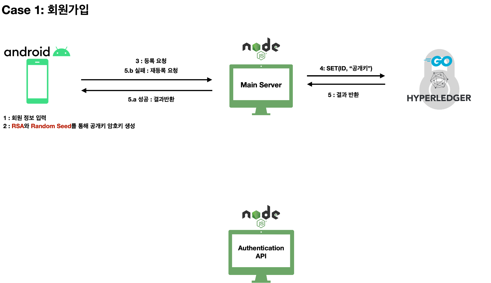
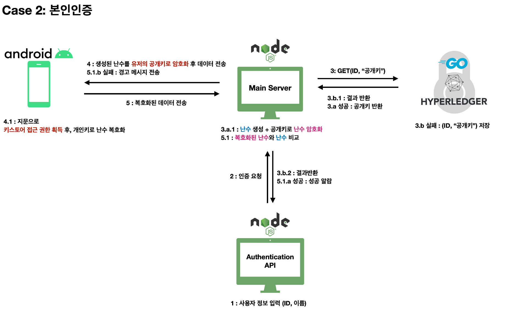

# Onece👆🏻


❗️ One + Once => Onece ❗️

```한번의 가입, 한번의 인증``` 을 통해 빠르게 본인인증을 할 수 있는 ```생체정보기반 하이퍼레져패브릭 신원인증 플랫폼``` Onece의 repository입니다.
</br>
__공인인증서의 5가지 조건을 만족하여 차세대 공인인증서로 개발__ 하고자 합니다.

_👏 우리는 411여개의 commit과 25개의 branch를 통한 많은 토의 끝에 배포되었습니다!!_

_🚀 Version 1.0.0 Released_

---

## Technology

- Hyperledger Fabric
- Go
- Android
- Node.js
- Firebase


## 핵심기능

[BlockChain]

- Hyperledger Fabric을 활용하여 블록체인 서버 구현
- Go 언어를 이용하여 체인코드 개발

[Web]

- Node.js기반의 RESTful API 서버 구현
- 사용자의 App으로 Firebase에 Push massage를 요청하는 라우터 구현

[Application]

- Push massage가 오면, 사용자의 생체정보인증을 통한 본인인증 기능
- 생체정보를 기반으로 복호화 및 결과 블록체인 서버에 반환

[Main Server]

- 난수의 암호화 및 반환
- 복호화된 난수와 원본 비교
- 웹 요청 처리 라우터를 통해 블록체인 서버와 통신





---

## Reference

- [Hyperledger Fabric document](https://www.hyperledger.org/use/fabric)


## License

All of source codes under our project are using [MIT License](http://opensource.org/licenses/MIT).

---

## Bletcher Team

- 남혜민 - [@hyemni](https://github.com/hyemni)
- 윤가영 - [@yoongoing](https://github.com/yoongoing)
- 위대한 - [@k2pGoing](https://github.com/k2pGoing)
- 최연욱 - [@yeonwook1993](https://github.com/eonwook1993)
